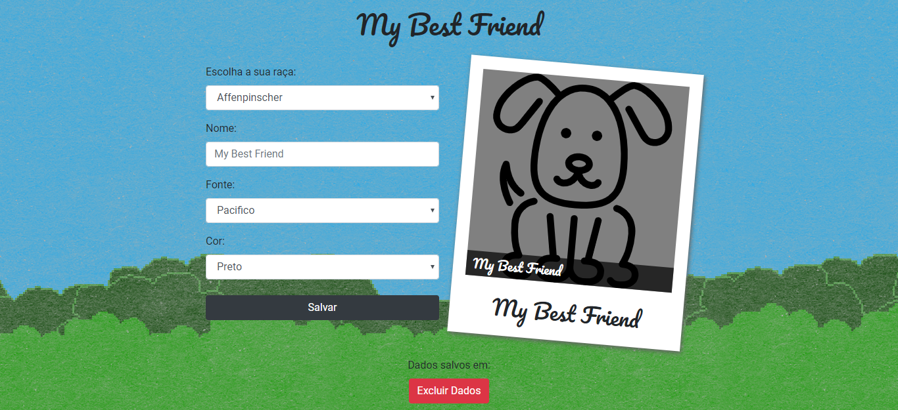

# My Best Friend

This is a simple project that uses the [Dog API](https://dog.ceo/dog-api/).

## Setup

Just clone the project and open the `index.html` page.

## This project uses

- CCS animation
- ESLint
- Google Web Fonts
- Local storage
- Public API
- Responsive Layout
- Vanilla JS

## To do

- Add some validations for the form
- Disable the 'exclude data button' when there's no data 
- Translate breeds to Portuguese
- Use Task Runner to minify the CSS and JS
- Unit Tests